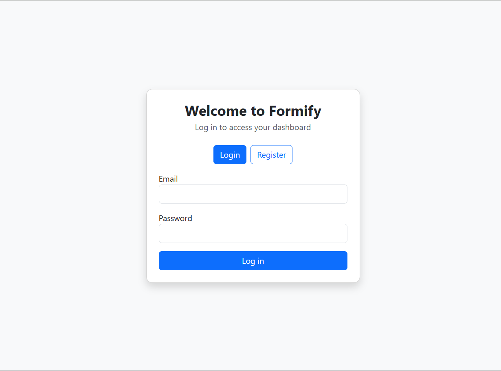
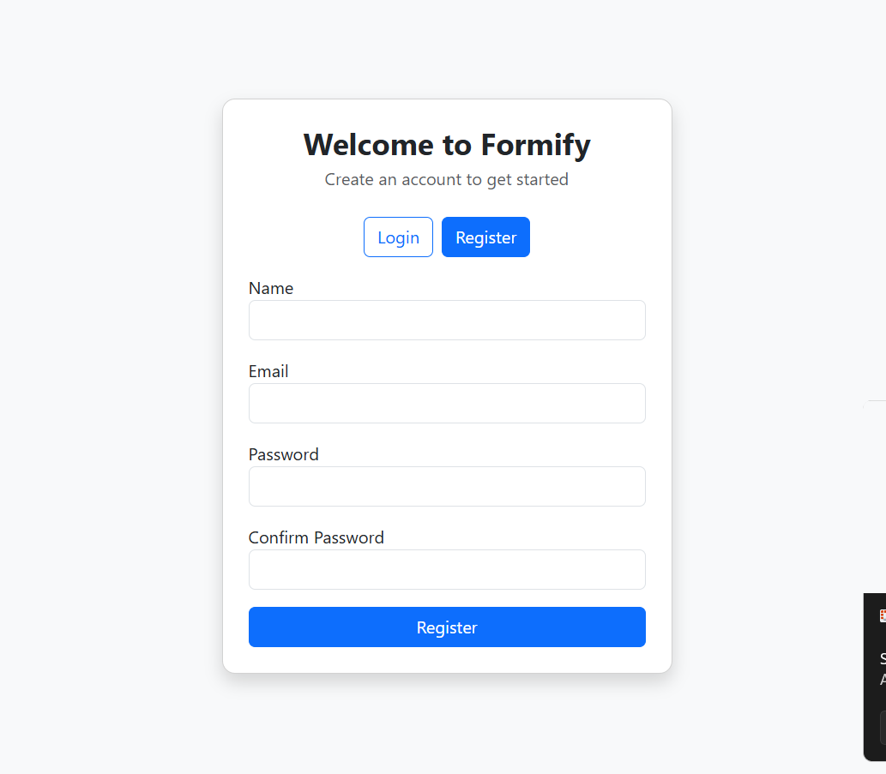
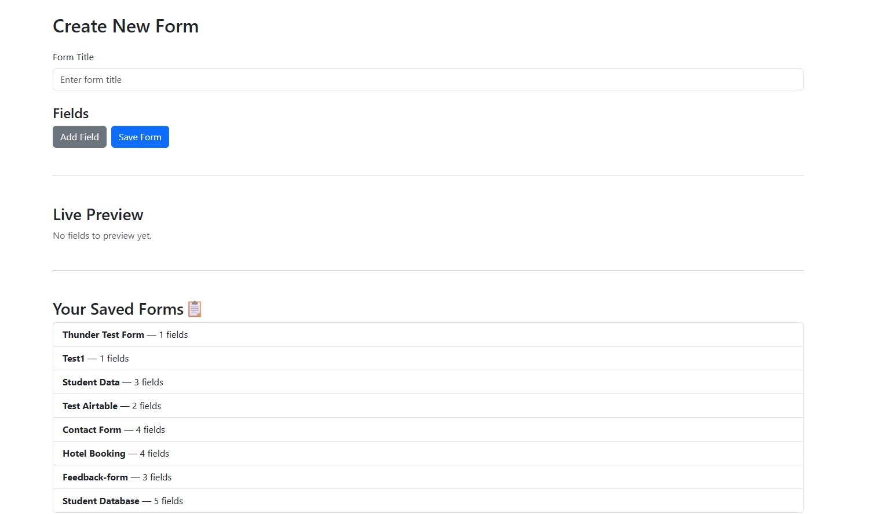
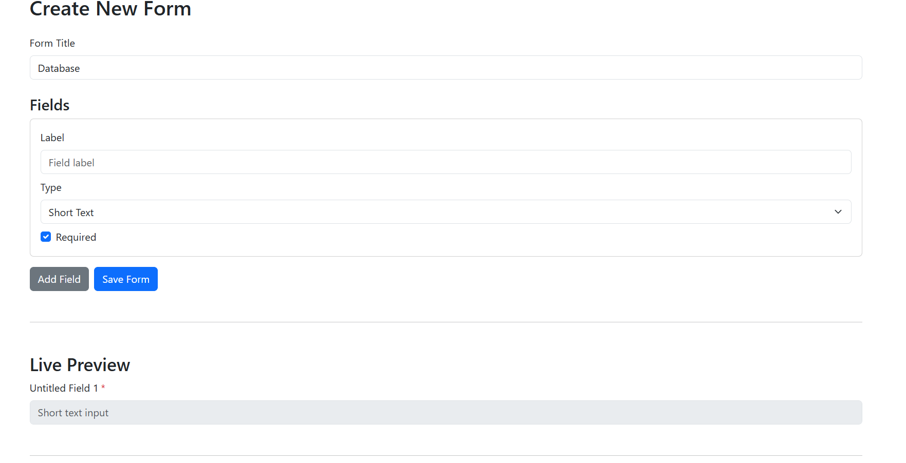

⚡️ Dynamic Form Builder – Frontend

# 🧠 Dynamic Airtable-Connected Form Builder (Frontend)

This is the **frontend** of a full-stack MERN application that allows users to create dynamic forms with conditional logic, preview them in real-time, and sync submissions to Airtable. Built with React and Vite, the UI is clean, responsive, and recruiter-ready.

---

## 🚀 Live Frontend

🔗 [https://dynamic-form-frontend-phiv.vercel.app](https://dynamic-form-frontend-phiv.vercel.app)

---

## 🛠 Tech Stack

- **React** (Vite)
- **Bootstrap** (UI styling)
- **Thunder Client** (API testing)
- **Vercel** (deployment)

---

## 📦 Features

### ✅ Core Functionality

- User login with dynamic owner tracking
- Form builder with Airtable field selection
- Conditional logic between questions
- Form viewer with dynamic field rendering
- Form submission to backend API

### 🎁 Bonus Features

- Form preview before submission
- Dashboard for saved forms
- Graceful fallback if Airtable user object is missing
- Clean, recruiter-ready UI

---

## 🧪 Conditional Logic

Each question can be shown or hidden based on previous answers.

**Example:**

> Show “GitHub URL” only if `Role = Engineer`

This logic is applied both in the form builder and dynamically during form filling.

---

## ⚙️ Setup Instructions

### 1. Clone the Repo

````bash
git clone https://github.com/navyaarora30/dynamic-form-builder.git
cd dynamic-form-builder/frontend

## 📁 Folder Structure

```text
dynamic-form-builder/
├── backend/
│   ├── controllers/
│   ├── models/
│   ├── screenshots/
│   ├── routes/
│   ├── utils/
│   ├── .env.example
│   ├── server.js
│   └── package.json
│   └── README.md
│   └── .env.example
│
├── frontend/
│   ├── components/
│   ├── pages/
│   ├── services/
│   ├── assets/
│   ├── screenshots/
│   ├── App.jsx
│   ├── main.jsx
│   └── package.json
│   └── README.md
│   └── .env.example
│
├── .env.example
├── README.md
````

---

2. Create .env File
   cp .env.example .env

Fill in:
VITE_BACKEND_URL=https://dynamic-form-backend-gumc.onrender.com

3. Install & Run
   npm install
   npm run dev

📸 Screenshots

### 🔐 Login Screen

[](./screenshots/login-page.png)
Users log in to access personalized form builder dashboard.

### 📝 Registration Screen

[](./screenshots/register-page.png)
New users can register with name, email, and password. Includes validation and clean UI.

### 🧠 Form Builder UI

[](./screenshots/form-builder-ui.png)
Users create custom forms with dynamic fields. Saved forms are listed for reuse and Airtable sync.

### 🧩 Field Creation

[](./screenshots/field-creation.png)
Each field supports label, type selection, and validation like “Required.” Live preview updates instantly.

🙌 Credits
Frontend built by Navya Arora for a MERN stack interview task.
Includes dynamic form logic, clean UI, and real-world Airtable integration.

---
